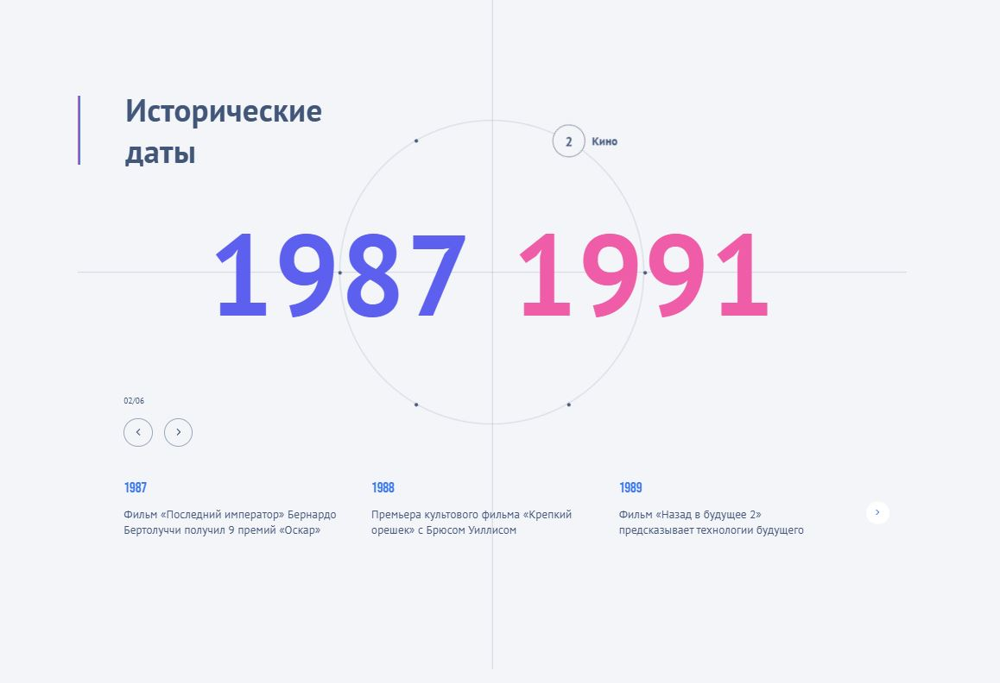

# Interactive Timeline App

Современное веб-приложение на React с иммерсивным интерфейсом и плавной анимацией. Проект демонстрирует сложную синхронизацию состояний React с анимационными библиотеками GSAP и Swiper.



## 🚀 Технологический стек

*   **Frontend:** React 19, TypeScript
*   **Animation:** GSAP (GreenSock Animation Platform)
*   **Slider:** Swiper.js
*   **Styling:** SCSS (методология BEM)

## ✨ Ключевые особенности

*   **Хореография анимаций GSAP:** Использование GSAP Timelines для создания сложных последовательных анимаций при смене временных периодов.
*   **Интеграция Swiper:** Глубокая кастомизация Swiper.js, синхронизированная с состоянием React для бесшовной навигации по слайдам.
*   **Управление состоянием:** Полностью реактивный интерфейс, где анимации триггерятся изменениями стейта, обеспечивая консистентность данных.
*   **Адаптивный Motion-дизайн:** Mobile-first подход — анимации и элементы управления оптимизированы под сенсорные экраны и различные разрешения.
*   **Интерактивный таймлайн:** Кастомная круговая навигация с динамическим позиционированием точек и программным управлением вращением.

## Запуск проекта

1. Клонируйте репозиторий:
```bash
git clone https://github.com/Oxana48/timeline-animation
```

2. Установите зависимости:
```bash
git install
```

3. Запустите проект:
```bash
npm run dev
```